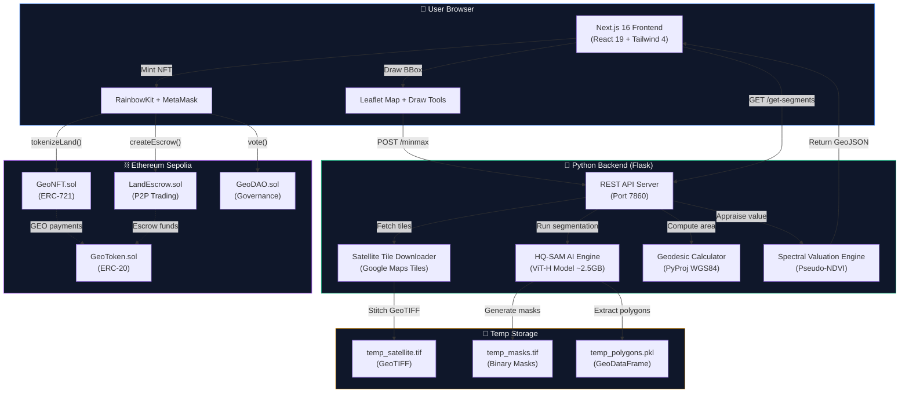

<div align="center">

# 🌍 GeoSense

### **AI-Powered Geospatial Intelligence Meets Web3 Land Tokenization**

*Measure. Analyze. Tokenize. Own.*

[](https://nextjs.org/)
[](https://react.dev/)
[](https://soliditylang.org/)
[](https://python.org/)
[](https://flask.palletsprojects.com/)
[](https://ethereum.org/)

[](https://opensource.org/licenses/MIT)
[](https://github.com/aditya-s45/GeoSense2)
[](http://makeapullrequest.com)

<br />

> **GeoSense** is a full-stack decentralized platform that uses **Meta's Segment Anything Model (HQ-SAM)** to automatically detect and segment land parcels from satellite imagery, then lets users **tokenize** those parcels as **ERC-721 NFTs** on the Ethereum blockchain — complete with on-chain geodesic area calculations, AI-driven land valuation, and a trustless P2P marketplace.

<br />

</div>

---

<details>
<summary><b>📖 Table of Contents</b></summary>

- [🎯 Why GeoSense?](#-why-geosense)
- [✨ Features](#-features)
- [🛠️ Tech Stack](#️-tech-stack)
- [🏗️ System Architecture](#️-system-architecture)
- [📂 Project Structure](#-project-structure)
- [🚀 Getting Started](#-getting-started)
- [📋 Usage Guide](#-usage-guide)
- [🔗 Smart Contracts](#-smart-contracts)
- [🧠 AI Engine Deep Dive](#-ai-engine-deep-dive)
- [🤝 Contributing](#-contributing)
- [📜 License](#-license)

</details>

---

## 🎯 Why GeoSense?

> *"In the developing world, **70% of land is unregistered.** Millions of farmers, families, and communities have no legal proof of ownership. Land disputes cause conflict, hinder investment, and trap people in poverty."*

Traditional land surveying is **expensive** ($5,000+ per parcel), **slow** (weeks of manual fieldwork), and **centralized** (dependent on corrupt government registries that can be altered or lost).

**GeoSense was built to change that.**

We asked a simple question:

> 💡 *What if anyone with a browser could draw a boundary on a satellite map, have AI automatically detect the land parcels, and mint a tamper-proof deed on the blockchain — in under 2 minutes?*

That's exactly what GeoSense does.

| Problem | GeoSense Solution |
|---|---|
| Manual land surveying costs thousands | **Free AI-powered satellite segmentation** |
| Paper records are forgeable & losable | **Immutable ERC-721 NFTs on Ethereum** |
| Centralized registries gatekeep ownership | **Decentralized, permissionless minting** |
| No interoperability with GIS software | **One-click GeoJSON export for QGIS/ArcGIS** |
| Land trading requires lawyers & middlemen | **Trustless P2P escrow smart contracts** |
| Valuation requires expensive appraisals | **AI-driven spectral analysis & auto-valuation** |

---

## ✨ Features

| Feature | Description |
|:---|:---|
| 🛰️ **Satellite Imagery Engine** | High-resolution Google satellite tile fetching with automatic zoom calibration and concurrent multi-threaded download |
| 🧠 **HQ-SAM AI Segmentation** | Meta's Segment Anything Model (High-Quality variant) auto-detects land parcels from satellite imagery with 95% IoU confidence |
| 📐 **Geodesic Area Calculation** | WGS84 ellipsoidal geodesic area computation using `pyproj` — accurate to centimeter precision |
| 🌿 **AI Land Valuation** | Spectral analysis of RGB channels computes pseudo-NDVI greenness index to classify land quality and estimate value |
| 🪙 **ERC-721 Land NFTs** | Each land parcel is minted as a unique NFT with on-chain metadata: coordinates, area (m²), estimated value, and timestamp |
| 💰 **GEO Utility Token** | ERC-20 governance token used for land valuation, marketplace transactions, and DAO voting |
| 🏪 **P2P Marketplace** | Trustless escrow-based land trading: list your parcel, buyers fund escrow, smart contract handles atomic swap |
| 🗳️ **DAO Governance** | On-chain proposal creation and token-weighted voting for platform decisions |
| 🗺️ **GeoJSON Export** | Download your NFT's exact vector polygon boundaries as industry-standard GeoJSON — importable into QGIS, ArcGIS, and Google Earth |
| 📊 **Portfolio Dashboard** | Visual property cards showing all owned land parcels with area, value, and export functionality |
| 🦊 **MetaMask Integration** | Seamless wallet connection via RainbowKit with multi-chain support |
| 🎨 **Glassmorphic UI** | Dark-mode, premium UI with animated transitions, Framer Motion effects, and responsive design |

---

## 🛠️ Tech Stack

<div align="center">

### Frontend
<p>
  
</p>

| Technology | Version | Purpose |
|:---|:---|:---|
| **Next.js** | 16.3 | React framework with App Router & SSR |
| **React** | 19 RC | UI component library |
| **Tailwind CSS** | 4.0 | Utility-first CSS framework |
| **Framer Motion** | 12.x | Animation library |
| **Leaflet** | 1.9 | Interactive maps & drawing tools |
| **RainbowKit** | 2.2 | Web3 wallet connection modal |
| **Wagmi** | 2.19 | React hooks for Ethereum |
| **Viem** | 2.38 | TypeScript Ethereum interface |
| **Radix UI** | Latest | Accessible UI primitives |

---

### Backend
<p>
  
</p>

| Technology | Version | Purpose |
|:---|:---|:---|
| **Python** | 3.11 | Backend runtime |
| **Flask** | 3.0 | REST API server |
| **HQ-SAM** | ViT-H | High-Quality Segment Anything Model |
| **PyTorch** | Latest | Deep learning inference engine |
| **Rasterio** | 1.3 | GeoTIFF raster I/O |
| **GeoPandas** | 0.14 | Geospatial DataFrames |
| **PyProj** | 3.6 | WGS84 geodesic calculations |
| **OpenCV** | 4.8 | Computer vision processing |
| **Pillow** | 10.1 | Image stitching & manipulation |

---

### Blockchain
<p>
  
  
  
</p>

| Technology | Version | Purpose |
|:---|:---|:---|
| **Solidity** | 0.8.24 | Smart contract language |
| **Hardhat** | 2.22 | Ethereum development environment |
| **OpenZeppelin** | 5.0 | Audited contract standards (ERC20, ERC721) |
| **Alchemy** | — | Sepolia RPC provider |
| **Ethers.js** | 6.x | Contract deployment & interaction |

</div>

---

## 🏗️ System Architecture



### Data Flow

```
📍 User draws bounding box on satellite map
       ↓
🛰️ Backend fetches high-res Google satellite tiles (zoom 18)
       ↓
🧩 Tiles stitched into georeferenced GeoTIFF (EPSG:4326)
       ↓
🧠 HQ-SAM segments land parcels with 95% IoU confidence
       ↓
📐 PyProj computes geodesic area on WGS84 ellipsoid
       ↓
🌿 Spectral analysis classifies: Lush | Urban | Barren
       ↓
💰 AI appraises value: 100 GEO/hectare × quality multiplier
       ↓
🪙 User mints ERC-721 NFT with on-chain metadata
       ↓
🏪 NFT tradeable on P2P escrow marketplace
```

---

## 📂 Project Structure

```
GeoSense/
│
├── 📁 blockchain/                    # Smart Contracts & Deployment
│   ├── 📁 contracts/
│   │   ├── GeoToken.sol              # ERC-20 utility & governance token
│   │   ├── GeoNFT.sol                # ERC-721 land parcel NFT
│   │   ├── LandEscrow.sol            # P2P trustless escrow trading
│   │   └── GeoDAO.sol                # On-chain DAO governance
│   ├── 📁 scripts/
│   │   └── deploy.js                 # Hardhat deployment script
│   ├── hardhat.config.js             # Network & compiler config
│   └── package.json
│
├── 📁 client-2/                      # Next.js 16 Frontend (Active)
│   ├── 📁 app/
│   │   ├── layout.jsx                # Root layout (Geist fonts + Providers)
│   │   ├── page.jsx                  # Landing page
│   │   ├── provider.jsx              # Wagmi + RainbowKit + React Query
│   │   ├── globals.css               # Tailwind v4 theme & custom styles
│   │   ├── 📁 geosense/
│   │   │   └── page.jsx              # 🗺️ Interactive Map + AI Segmentation
│   │   ├── 📁 dashboard/
│   │   │   └── page.jsx              # 📊 Portfolio + GeoJSON Export
│   │   └── 📁 marketplace/
│   │       └── page.jsx              # 🏪 P2P Escrow Marketplace
│   ├── 📁 components/
│   │   ├── Navbar.jsx                # Glassmorphic nav + wallet connect
│   │   ├── MapComponent.jsx          # Leaflet map with draw & GeoJSON
│   │   ├── SideBar.jsx               # AI workflow panel + NFT minting
│   │   ├── FeatureCard.jsx           # BBox card + segmentation trigger
│   │   ├── hero_section.jsx          # Animated landing hero
│   │   └── 📁 ui/                    # Radix UI primitives
│   ├── 📁 config/
│   │   └── contracts.js              # Contract addresses & ABIs
│   ├── 📁 hooks/
│   │   └── useContracts.js           # Wagmi custom hooks
│   └── package.json
│
├── 📁 server/                        # Python AI Backend
│   ├── server.py                     # Flask REST API (5 endpoints)
│   ├── segment_land_hqsam.py         # HQ-SAM segmentation engine
│   ├── download_tiles.py             # Satellite tile fetcher & stitcher
│   ├── requirements.txt              # Python dependencies
│   └── Dockerfile                    # Docker deployment config
│
├── update_abi.js                     # Auto-sync ABIs to frontend
├── environment.yml                   # Conda environment spec
└── requirements.txt                  # Root Python dependencies
```

---

## 🚀 Getting Started

### Prerequisites

- **Node.js** ≥ 18.x & **npm** ≥ 9.x
- **Python** ≥ 3.9
- **MetaMask** browser extension
- **Git**

### 1️⃣ Clone the Repository

```bash
git clone https://github.com/aditya-s45/GeoSense2.git
cd GeoSense2/Geosense-interiiit-main
```

### 2️⃣ Setup the AI Backend

```bash
cd server

# Create a virtual environment (recommended)
python -m venv venv
# Windows:
venv\Scripts\activate
# macOS/Linux:
source venv/bin/activate

# Install dependencies
pip install -r requirements.txt

# Install PyTorch (CPU-only, recommended for most users)
pip install torch torchvision --index-url https://download.pytorch.org/whl/cpu

# Install the HQ-SAM geospatial library
pip install segment-geospatial[hq]

# Start the backend server
python server.py
```

> 🟢 The Flask server will start on `http://127.0.0.1:7860`
>
> ⚠️ **First Run:** The HQ-SAM model (~2.5GB) will be downloaded automatically on first segmentation request.

### 3️⃣ Setup the Frontend

```bash
cd ../client-2

# Install all dependencies
npm install

# Create environment file
echo NEXT_PUBLIC_BACKEND_URL=http://127.0.0.1:7860 > .env.local

# Start the development server
npm run dev
```

> 🟢 The Next.js app will start on `http://localhost:3000`

### 4️⃣ Setup Smart Contracts *(Optional — already deployed on Sepolia)*

```bash
cd ../blockchain

# Install dependencies
npm install

# Compile contracts
npx hardhat compile

# Deploy to local Hardhat node
npx hardhat node                                    # Terminal 1
npx hardhat run scripts/deploy.js --network localhost  # Terminal 2

# Deploy to Sepolia testnet
# (Requires ALCHEMY_API_URL and PRIVATE_KEY in blockchain/.env)
npx hardhat run scripts/deploy.js --network sepolia
```

### 5️⃣ Connect Your Wallet

1. Open `http://localhost:3000` in your browser
2. Click the **wallet button** in the navbar
3. Connect **MetaMask** (switch to **Sepolia Testnet**)
4. Get free Sepolia ETH from [Google Faucet](https://cloud.google.com/application/web3/faucet/ethereum/sepolia)

---

## 📋 Usage Guide

### Step 1: Draw a Boundary 📍
Navigate to the **Map Interface** and use the rectangle draw tool to select a region of interest on the satellite map.

### Step 2: AI Land Detection 🧠
Click **"Start AI Land Detection"** in the sidebar. The system will:
- Download high-resolution satellite tiles
- Run HQ-SAM segmentation to detect land parcels
- Display detected parcels as interactive polygons

### Step 3: Select & Calculate 📐
Click on detected land parcels to select them. Hit **"Calculate Total Area"** to get:
- Exact geodesic area in m² and hectares
- AI-driven land quality classification (Lush / Urban / Barren)
- Estimated value in GEO tokens

### Step 4: Mint as NFT 🪙
Click **"Mint GeoNFT"** to tokenize your selected parcels on the Ethereum blockchain. Confirm the transaction in MetaMask.

### Step 5: Manage Portfolio 📊
Visit the **Dashboard** to see all your owned land parcels with visual property cards. Click **"Export to GIS"** to download the exact polygon boundaries as a `.geojson` file.

### Step 6: Trade on Marketplace 🏪
List your land NFT for sale on the **Marketplace**, or browse and buy others' parcels through the trustless escrow system.

---

## 🔗 Smart Contracts

> All contracts are deployed and verified on the **Ethereum Sepolia Testnet**.

| Contract | Address | Standard |
|:---|:---|:---|
| **GeoToken** | [`0x10fF...ab5A5`](https://sepolia.etherscan.io/address/0x10fFe5f723B0D9d8Bef3B833686630eA5B8ab5A5) | ERC-20 |
| **GeoNFT** | [`0xa095...Ef688`](https://sepolia.etherscan.io/address/0xa09541C11897A5229e8f2D85CD95c129199Ef688) | ERC-721 |
| **LandEscrow** | [`0xaf68...25bB9`](https://sepolia.etherscan.io/address/0xaf683a58BbfAD52BeA58e12E6D60Ee5f7f225bB9) | Custom Escrow |
| **GeoDAO** | [`0xCf7E...0Fc9`](https://sepolia.etherscan.io/address/0xCf7Ed3AccA5a467e9e704C703E8D87F634fB0Fc9) | DAO Governance |

### Contract Architecture

```
GeoToken (ERC-20)          GeoNFT (ERC-721)
     │                          │
     │   ┌──────────────────────┤
     ▼   ▼                      │
LandEscrow ◄───────────────────-┘
  (P2P Trading)
     │
     ▼
  GeoDAO
  (Governance)
```

---

## 🧠 AI Engine Deep Dive

### Satellite Imagery Pipeline

The backend uses a **multi-threaded tile stitching engine** that:
1. Converts WGS84 bounding box → tile grid coordinates at zoom level 18
2. Downloads 256×256px tiles concurrently (10 threads) from Google satellite servers
3. Stitches tiles into a single georeferenced **GeoTIFF** with proper affine transform
4. Auto-downsizes zoom level if tile count exceeds 100 (prevents rate limiting)

### HQ-SAM Segmentation

GeoSense uses **Meta's High-Quality Segment Anything Model (HQ-SAM)** with the **ViT-H** backbone:

| Parameter | Value | Purpose |
|:---|:---|:---|
| `points_per_side` | 24 | Grid sampling density |
| `pred_iou_thresh` | 0.90 | High confidence threshold |
| `stability_score_thresh` | 0.95 | Mask stability filter |
| `min_mask_region_area` | 5,000 | Removes micro-artifacts |
| `box_nms_thresh` | 0.70 | Non-max suppression |

### AI Land Valuation

Each detected parcel undergoes **spectral analysis** using the RGB channels of the satellite imagery:

$$\text{Greenness Index} = \frac{G - R}{G + R + 0.01}$$

| Greenness | Classification | Price Multiplier |
|:---|:---|:---|
| > 0.05 | 🌿 Lush Vegetation | 1.5× |
| < -0.05 | 🏙️ Urban / Developed | 2.0× |
| Otherwise | 🏜️ Barren / Scrub | 0.8× |

> **Base Rate:** 100 GEO tokens per hectare (10,000 m²)

---

## 🤝 Contributing

Contributions are what make the open-source community amazing. Any contributions you make are **greatly appreciated**.

1. Fork the Project
2. Create your Feature Branch (`git checkout -b feature/AmazingFeature`)
3. Commit your Changes (`git commit -m 'Add some AmazingFeature'`)
4. Push to the Branch (`git push origin feature/AmazingFeature`)
5. Open a Pull Request

---

## 📜 License

Distributed under the **MIT License**. See `LICENSE` for more information.

---

<div align="center">

### Built with 🔥 by [Aditya Shingare](https://github.com/aditya-s45)

*Where AI meets the blockchain to democratize land ownership for the world.*

<br />

**⭐ Star this repo if you found it useful! ⭐**

</div>
