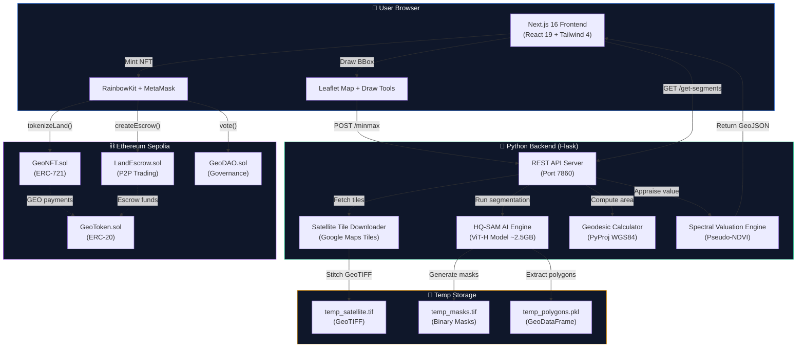

<p align="center">
  
</p>

<h1 align="center">🌍 PixelDeed</h1>

<p align="center">
  <strong>AI-Powered Satellite Land Segmentation → Blockchain NFT Tokenization — From pixel to deed in under 2 minutes.</strong>
</p>

<p align="center">
  
  
  
  
  
  
</p>

<p align="center">
  
  
  
  
</p>

---

## 📖 Table of Contents

- [The Problem](#-the-problem)
- [The Solution](#-the-solution)
- [Features](#-features)
- [Tech Stack](#️-tech-stack)
- [System Architecture](#️-system-architecture)
- [How It Works](#-how-it-works)
- [Project Structure](#-project-structure)
- [Installation](#-installation)
- [Usage](#️-usage)
- [Smart Contracts](#-smart-contracts)
- [API Reference](#-api-reference)
- [AI Engine Deep Dive](#-ai-engine-deep-dive)
- [Contributing](#-contributing)
- [License](#-license)

---

## 😤 The Problem

Land ownership is one of the most broken systems on the planet. Here's why:

| Challenge | Impact |
|---|---|
| **70% of global land is unregistered** | Billions of people have no legal proof of ownership |
| **Manual surveying costs $5,000+** | Pricing out small farmers and rural communities |
| **Weeks of fieldwork** | A single surveyor with GPS equipment, walking the perimeter |
| **Paper-based registries** | Forgeable, losable, corruptible by officials |
| **No interoperability** | Government land records can't talk to banks, insurers, or GIS software |
| **Expensive appraisals** | $300-$500 per parcel just to estimate what land is worth |
| **Opaque trading** | Buying land requires lawyers, notaries, escrow agents, and 30-90 days |

> **Bottom line:** If you're a farmer in rural India, Africa, or South America — you could be sitting on ancestral land your family has worked for generations, and you have **zero verifiable proof** that it's yours. If a developer or government wants to take it, there's nothing on paper to stop them. 💀

---

## 💡 The Solution

**PixelDeed** replaces the entire $300B land surveying industry with a browser tab. You draw a box on a satellite map, AI detects the parcels, and a smart contract mints your deed — in **under 2 minutes**.

```
┌──────────────────────────────────────────────────────────┐
│            WHAT YOU DO (3 things)                         │
│                                                          │
│   1. Draw a rectangle on the satellite map               │
│   2. Click "Start AI Land Detection"                     │
│   3. Confirm the MetaMask transaction                    │
│                                                          │
│            WHAT PIXELDEED DOES (everything else)          │
│                                                          │
│   ✅ Downloads high-res satellite tiles (zoom level 18)   │
│   ✅ Stitches tiles into a georeferenced GeoTIFF          │
│   ✅ Runs Meta's HQ-SAM AI to segment land parcels       │
│   ✅ Converts raster masks → vector polygon geometries    │
│   ✅ Computes geodesic area on WGS84 ellipsoid (cm²)     │
│   ✅ Analyzes RGB spectral data for land classification   │
│   ✅ Appraises land value using pseudo-NDVI greenness     │
│   ✅ Renders interactive polygons on a Leaflet map        │
│   ✅ Lets you select & combine multiple parcels           │
│   ✅ Mints an ERC-721 NFT with on-chain coordinates      │
│   ✅ Stores area, value, timestamp permanently on-chain   │
│   ✅ Enables P2P trading via trustless escrow contracts   │
│   ✅ Exports exact boundaries as GeoJSON for QGIS/ArcGIS │
│   ✅ Provides portfolio dashboard with property cards     │
└──────────────────────────────────────────────────────────┘
```

---

## ✨ Features

| Feature | Description |
|:---|:---|
| 🛰️ **Satellite Imagery Engine** | High-resolution Google satellite tile fetching with automatic zoom calibration and concurrent multi-threaded download |
| 🧠 **HQ-SAM AI Segmentation** | Meta's Segment Anything Model (High-Quality variant) auto-detects land parcels from satellite imagery with 95% IoU confidence |
| 📐 **Geodesic Area Calculation** | WGS84 ellipsoidal geodesic area computation using `pyproj` — accurate to centimeter precision |
| 🌿 **AI Land Valuation** | Spectral analysis of RGB channels computes pseudo-NDVI greenness index to classify land quality and estimate value |
| 🪙 **ERC-721 Land NFTs** | Each land parcel is minted as a unique NFT with on-chain metadata: coordinates, area (m²), estimated value, and timestamp |
| 💰 **GEO Utility Token** | ERC-20 governance token used for land valuation, marketplace transactions, and DAO voting |
| 🏪 **P2P Marketplace** | Trustless escrow-based land trading: list your parcel, buyers fund escrow, smart contract handles atomic swap |
| 🗳️ **DAO Governance** | On-chain proposal creation and token-weighted voting for platform decisions |
| 🗺️ **GeoJSON Export** | Download your NFT's exact vector polygon boundaries as industry-standard GeoJSON — importable into QGIS, ArcGIS, and Google Earth |
| 📊 **Portfolio Dashboard** | Visual property cards showing all owned land parcels with area, value, and export functionality |
| 🦊 **MetaMask Integration** | Seamless wallet connection via RainbowKit with multi-chain support |
| 🎨 **Glassmorphic UI** | Dark-mode, premium UI with animated transitions, Framer Motion effects, and responsive design |

---

## 🛠️ Tech Stack

<div align="center">

### Frontend
<p>
  
</p>

| Technology | Version | Purpose |
|:---|:---|:---|
| **Next.js** | 16.3 | React framework with App Router & SSR |
| **React** | 19 RC | UI component library |
| **Tailwind CSS** | 4.0 | Utility-first CSS framework |
| **Framer Motion** | 12.x | Animation library |
| **Leaflet** | 1.9 | Interactive maps & drawing tools |
| **RainbowKit** | 2.2 | Web3 wallet connection modal |
| **Wagmi** | 2.19 | React hooks for Ethereum |
| **Viem** | 2.38 | TypeScript Ethereum interface |
| **Radix UI** | Latest | Accessible UI primitives |

---

### Backend
<p>
  
</p>

| Technology | Version | Purpose |
|:---|:---|:---|
| **Python** | 3.11 | Backend runtime |
| **Flask** | 3.0 | REST API server |
| **HQ-SAM** | ViT-H | High-Quality Segment Anything Model |
| **PyTorch** | Latest | Deep learning inference engine |
| **Rasterio** | 1.3 | GeoTIFF raster I/O |
| **GeoPandas** | 0.14 | Geospatial DataFrames |
| **PyProj** | 3.6 | WGS84 geodesic calculations |
| **OpenCV** | 4.8 | Computer vision processing |
| **Pillow** | 10.1 | Image stitching & manipulation |

---

### Blockchain
<p>
  
  
  
</p>

| Technology | Version | Purpose |
|:---|:---|:---|
| **Solidity** | 0.8.24 | Smart contract language |
| **Hardhat** | 2.22 | Ethereum development environment |
| **OpenZeppelin** | 5.0 | Audited contract standards (ERC20, ERC721) |
| **Alchemy** | — | Sepolia RPC provider |
| **Ethers.js** | 6.x | Contract deployment & interaction |

</div>

---

## 🏗️ System Architecture



### Data Flow Summary

```
📍 User draws bounding box on satellite map
       ↓
🛰️ Backend fetches high-res Google satellite tiles (zoom 18)
       ↓
🧩 Tiles stitched into georeferenced GeoTIFF (EPSG:4326)
       ↓
🧠 HQ-SAM segments land parcels with 95% IoU confidence
       ↓
📐 PyProj computes geodesic area on WGS84 ellipsoid
       ↓
🌿 Spectral analysis classifies: Lush | Urban | Barren
       ↓
💰 AI appraises value: 100 GEO/hectare × quality multiplier
       ↓
🪙 User mints ERC-721 NFT with on-chain metadata
       ↓
🏪 NFT tradeable on P2P escrow marketplace
```

---

## ⚙️ How It Works

The platform executes a **6-step pipeline**, each step building on the previous:

### Step-by-Step Execution Flow

```
 START
   │
   ▼
┌──────────────────────────────────────────┐
│  STEP 1: SATELLITE DOWNLOAD              │  ~3-8s
│  ├─ Convert WGS84 bbox → tile grid      │
│  ├─ Download 256×256 tiles (10 threads)  │
│  ├─ Auto-reduce zoom if > 100 tiles     │
│  ├─ Stitch into single RGB image         │
│  ├─ Compute affine transform matrix      │
│  └─ Save as GeoTIFF (EPSG:4326)          │
└──────────────────┬───────────────────────┘
                   ▼
┌──────────────────────────────────────────┐
│  STEP 2: AI SEGMENTATION                 │  ~15-45s
│  ├─ Convert GeoTIFF → PNG                │
│  ├─ Load HQ-SAM ViT-H model (2.5GB)     │
│  ├─ Run automatic mask generation        │
│  ├─ Filter: IoU ≥ 0.90, stability ≥ 0.95│
│  ├─ Remove micro-artifacts (< 5000 px)   │
│  ├─ Generate binary mask GeoTIFF         │
│  └─ Convert raster masks → polygons      │
└──────────────────┬───────────────────────┘
                   ▼
┌──────────────────────────────────────────┐
│  STEP 3: ANALYSIS & VALUATION            │  ~1-2s
│  ├─ Reproject polygons to WGS84          │
│  ├─ Compute geodesic area (pyproj)       │
│  ├─ Mask satellite image per polygon     │
│  ├─ Extract mean R, G, B intensities     │
│  ├─ Calculate pseudo-NDVI greenness      │
│  ├─ Classify: Lush / Urban / Barren      │
│  ├─ Apply price multiplier               │
│  └─ Return GeoJSON with metadata         │
└──────────────────┬───────────────────────┘
                   ▼
┌──────────────────────────────────────────┐
│  STEP 4: INTERACTIVE SELECTION           │  User action
│  ├─ Render polygons on Leaflet map       │
│  ├─ User clicks to select parcels        │
│  ├─ Highlight selected (blue overlay)    │
│  ├─ Calculate combined area              │
│  └─ Show AI appraisal (quality + GEO)    │
└──────────────────┬───────────────────────┘
                   ▼
┌──────────────────────────────────────────┐
│  STEP 5: BLOCKCHAIN MINTING             │  ~15-30s
│  ├─ Pack coordinates as GeoJSON string   │
│  ├─ Call tokenizeLand() on GeoNFT        │
│  ├─ ⏸️  User confirms in MetaMask         │
│  ├─ Store on-chain: coords, area, value  │
│  └─ NFT minted to user's wallet          │
└──────────────────┬───────────────────────┘
                   ▼
┌──────────────────────────────────────────┐
│  STEP 6: POST-MINT OPTIONS               │
│  ├─ View in Portfolio Dashboard          │
│  ├─ Export boundaries as .geojson        │
│  ├─ List for sale on P2P Marketplace     │
│  └─ Vote on DAO governance proposals     │
└──────────────────────────────────────────┘
                   │
                   ▼
                DONE 🎉
```

### Key Technical Details

#### Coordinate → Tile Conversion

PixelDeed converts lat/lng to Google Maps tile indices using the [Slippy Map](https://wiki.openstreetmap.org/wiki/Slippy_map_tilenames) convention:

```python
def deg2num(lat_deg, lon_deg, zoom):
    """Convert WGS84 coordinates to tile grid position."""
    lat_rad = math.radians(lat_deg)
    n = 2.0 ** zoom
    xtile = int((lon_deg + 180.0) / 360.0 * n)
    ytile = int((1.0 - math.asinh(math.tan(lat_rad)) / math.pi) / 2.0 * n)
    return (xtile, ytile)
```

#### Concurrent Tile Download

Instead of sequential downloads (~30s), PixelDeed uses a 10-thread pool:

```python
with concurrent.futures.ThreadPoolExecutor(max_workers=10) as executor:
    future_to_coords = {
        executor.submit(download_tile, x, y, zoom): (x, y)
        for x in range(x_min, x_max + 1)
        for y in range(y_min, y_max + 1)
    }
```

#### GeoTIFF Stitching

Individual tiles are stitched and saved as a georeferenced GeoTIFF with proper spatial metadata:

```python
transform = from_bounds(
    actual_min_lon, actual_min_lat,
    actual_max_lon, actual_max_lat,
    stitched_image.width, stitched_image.height
)

with rasterio.open(output_path, 'w', driver='GTiff',
                   height=height, width=width,
                   count=3, dtype='uint8',
                   crs='EPSG:4326', transform=transform) as dst:
    dst.write(img_array)
```

#### CPU Compatibility Patch

HQ-SAM ships with CUDA-trained weights that crash on CPU-only machines. PixelDeed patches this at the Python import level:

```python
# Monkey-patch torch.load BEFORE importing samgeo
original_torch_load = torch.load

def cpu_torch_load(path, map_location=None, **kwargs):
    return original_torch_load(path, map_location=torch.device('cpu'), **kwargs)

torch.load = cpu_torch_load  # All subsequent loads go to CPU

from samgeo.hq_sam import SamGeo  # Now loads without CUDA error
```

> Without this patch, `torch.cuda.is_available() is False` causes an immediate crash during model deserialization. This was a critical fix.

---

## 📁 Project Structure

```
PixelDeed/
│
├── 📄 README.md                        # You are here
├── 📄 update_abi.js                    # Auto-sync contract ABIs → frontend
├── 📄 environment.yml                  # Conda environment spec
├── 📄 requirements.txt                 # Root Python dependencies
│
├── 📁 blockchain/                      # ⛓️ Smart Contracts
│   ├── 📁 contracts/
│   │   ├── GeoToken.sol                #    ERC-20 utility & governance token
│   │   ├── GeoNFT.sol                  #    ERC-721 land parcel NFT
│   │   ├── LandEscrow.sol              #    Trustless P2P escrow trading
│   │   └── GeoDAO.sol                  #    On-chain DAO governance
│   ├── 📁 scripts/
│   │   └── deploy.js                   #    Hardhat deployment script
│   ├── hardhat.config.js               #    Solidity compiler + network config
│   └── package.json
│
├── 📁 client-2/                        # 🖥️ Next.js 16 Frontend
│   ├── 📁 app/
│   │   ├── layout.jsx                  #    Root layout (fonts + providers)
│   │   ├── page.jsx                    #    Landing page (hero + globe)
│   │   ├── provider.jsx                #    Wagmi + RainbowKit + React Query
│   │   ├── globals.css                 #    Tailwind v4 theme + glassmorphism
│   │   ├── 📁 pixeldeed/
│   │   │   └── page.jsx                #    🗺️ Map Interface + AI Trigger
│   │   ├── 📁 dashboard/
│   │   │   └── page.jsx                #    📊 Portfolio + GeoJSON Export
│   │   └── 📁 marketplace/
│   │       └── page.jsx                #    🏪 P2P Marketplace
│   ├── 📁 components/
│   │   ├── Navbar.jsx                  #    Glassmorphic nav + wallet button
│   │   ├── hero_section.jsx            #    Animated landing with globe
│   │   ├── MapComponent.jsx            #    Leaflet map + polygon overlays
│   │   ├── SideBar.jsx                 #    AI workflow panel + NFT minting
│   │   ├── FeatureCard.jsx             #    BBox display + progress bar
│   │   ├── SearchControl.jsx           #    Map location search
│   │   ├── SearchSidebar.jsx           #    Search results panel
│   │   └── 📁 ui/                      #    Radix UI primitives
│   ├── 📁 config/
│   │   └── contracts.js                #    Deployed addresses + ABIs
│   ├── 📁 hooks/
│   │   └── useContracts.js             #    useTokenizeLand, useLandDetails
│   ├── 📁 lib/
│   │   ├── EditControl.js              #    Leaflet-Draw wrapper
│   │   └── utils.js                    #    Utility functions
│   ├── 📁 ui_comp/
│   │   ├── text.js                     #    SplitText animation component
│   │   └── de_para.js                  #    DecryptedText scramble effect
│   └── package.json
│
├── 📁 server/                          # 🐍 Python AI Backend
│   ├── server.py                       #    Flask REST API (5 endpoints)
│   ├── segment_land_hqsam.py           #    HQ-SAM segmentation engine
│   ├── download_tiles.py               #    Satellite tile fetcher + stitcher
│   ├── requirements.txt                #    Python dependencies
│   └── Dockerfile                      #    Docker deployment config
│
└── 📁 temp/                            # 📂 Runtime artifacts
    ├── 📁 imagery/
    │   └── temp_satellite.tif          #    Stitched GeoTIFF
    └── 📁 segmentation/
        ├── temp_masks.tif              #    Binary segmentation masks
        ├── temp_polygons.pkl           #    GeoDataFrame (pickle)
        └── temp_polygons.shp           #    Shapefile output
```

### File Size Breakdown

| File | Lines | Role |
|---|---|---|
| `server.py` | 237 | Flask API — routing, area calc, valuation engine |
| `segment_land_hqsam.py` | 206 | HQ-SAM model loading, segmentation, mask→polygon |
| `download_tiles.py` | 125 | Tile fetcher, concurrent downloader, GeoTIFF stitcher |
| `MapComponent.jsx` | 400+ | Leaflet map, draw tools, polygon rendering |
| `SideBar.jsx` | 300+ | 4-step workflow panel, NFT minting trigger |
| `FeatureCard.jsx` | 185 | BBox card, AI trigger, real-time progress polling |
| `marketplace/page.jsx` | 335 | Escrow creation, funding, completion UI |
| `dashboard/page.jsx` | 190 | Portfolio stats, property cards, GeoJSON export |
| `contracts.js` | 11 | All 4 contract addresses + full ABIs |

---

## 🚀 Installation

### Prerequisites

| Requirement | Version | Check |
|---|---|---|
| **Node.js** | ≥ 18.x | `node --version` |
| **npm** | ≥ 9.x | `npm --version` |
| **Python** | ≥ 3.9 | `python --version` |
| **MetaMask** | Latest | Browser extension |
| **Git** | Latest | `git --version` |

### 1️⃣ Clone the Repository

```bash
git clone https://github.com/aditya-s45/PixelDeed2.git
cd PixelDeed2/Geosense-interiiit-main
```

### 2️⃣ Setup the AI Backend

```bash
cd server

# Create virtual environment
python -m venv venv

# Activate it
# Windows:
venv\Scripts\activate
# macOS/Linux:
source venv/bin/activate

# Install core dependencies
pip install -r requirements.txt

# Install PyTorch (CPU-only build — no GPU needed)
pip install torch torchvision --index-url https://download.pytorch.org/whl/cpu

# Install HQ-SAM geospatial library
pip install segment-geospatial[hq]

# Start the backend
python server.py
```

> 🟢 Server starts on `http://127.0.0.1:7860`
>
> ⚠️ **First run:** The HQ-SAM model (~2.5GB) auto-downloads on the first segmentation request. This only happens once.

### 3️⃣ Setup the Frontend

```bash
# Open a new terminal
cd client-2

# Install dependencies
npm install

# Create environment config
echo NEXT_PUBLIC_BACKEND_URL=http://127.0.0.1:7860 > .env.local

# Start the dev server
npm run dev
```

> 🟢 Frontend starts on `http://localhost:3000`

### 4️⃣ Setup Smart Contracts *(Optional — already deployed on Sepolia)*

```bash
cd blockchain

# Install dependencies
npm install

# Option A: Local Hardhat network
npx hardhat node                                       # Terminal 1
npx hardhat run scripts/deploy.js --network localhost   # Terminal 2

# Option B: Deploy to Sepolia testnet
# (Requires ALCHEMY_API_URL and PRIVATE_KEY in blockchain/.env)
npx hardhat run scripts/deploy.js --network sepolia
```

### 5️⃣ Connect Your Wallet

1. Open `http://localhost:3000` in your browser
2. Click the wallet button in the navbar → Connect **MetaMask**
3. Switch to **Sepolia Testnet** in MetaMask
4. Get free test ETH from [Google Faucet](https://cloud.google.com/application/web3/faucet/ethereum/sepolia) or [Alchemy Faucet](https://sepoliafaucet.com/)

---

## 🖥️ Usage

### Step 1: Enter Mission Control 🚀
Click **"Enter Mission Control"** on the landing page. The animated globe shifts, and the interface reveals itself with a typing/decrypt effect.

### Step 2: Draw a Boundary 📍
On the Map Interface, use the **rectangle draw tool** (top-left corner of the map) to select a region of interest on the satellite imagery.

### Step 3: AI Land Detection 🧠
Click **"Start AI Land Detection"** in the sidebar card. Watch the real-time progress bar:
- `25%` — Downloading satellite tiles...
- `50%` — Running AI segmentation...
- `100%` — Complete!

### Step 4: Select Parcels 📐
Detected land parcels appear as interactive polygons. **Click on parcels** to select them (they highlight). Click **"Calculate Total Area"** to see:
- Exact geodesic area in m² and hectares
- Land quality classification (Lush / Urban / Barren)
- Estimated value in GEO tokens

### Step 5: Mint Your Deed 🪙
Click **"Mint GeoNFT for these Parcels"** → Confirm the MetaMask popup → Wait for the transaction to confirm on Sepolia.

### Step 6: Manage & Trade 📊
- **Dashboard:** View your portfolio cards, total stats, and export any parcel as `.geojson`
- **Marketplace:** List parcels for sale or buy others' land through trustless escrow

### Pro Tips 🎯

> - **Zoom in close** before drawing your bounding box — HQ-SAM works best at zoom level 16-18
> - **Smaller regions** = faster processing. Start with a neighborhood block, not an entire city
> - **Google Satellite** tile layer gives the best segmentation results (vs. OpenStreetMap)
> - **The GeoJSON export** is a real `.geojson` file that opens directly in QGIS or [geojson.io](https://geojson.io/)

---

## 🔗 Smart Contracts

> All contracts are live and verified on **Ethereum Sepolia Testnet**.

| Contract | Address | Standard | Purpose |
|---|---|---|---|
| **GeoToken** | [`0x10fFe5...ab5A5`](https://sepolia.etherscan.io/address/0x10fFe5f723B0D9d8Bef3B833686630eA5B8ab5A5) | ERC-20 | Utility & governance token (10M supply) |
| **GeoNFT** | [`0xa0954...Ef688`](https://sepolia.etherscan.io/address/0xa09541C11897A5229e8f2D85CD95c129199Ef688) | ERC-721 | Land parcel deed NFT |
| **LandEscrow** | [`0xaf683...25bB9`](https://sepolia.etherscan.io/address/0xaf683a58BbfAD52BeA58e12E6D60Ee5f7f225bB9) | Custom | Trustless P2P escrow trading |
| **GeoDAO** | [`0xCf7Ed...0Fc9`](https://sepolia.etherscan.io/address/0xCf7Ed3AccA5a467e9e704C703E8D87F634fB0Fc9) | Custom | On-chain DAO governance |

### Contract Interaction Flow

```
                    ┌─────────────┐
                    │   GeoToken  │
                    │   (ERC-20)  │
                    │             │
                    │  10M Supply │
                    └──────┬──────┘
                           │
              ┌────────────┼────────────┐
              │            │            │
              ▼            ▼            ▼
       ┌────────────┐ ┌─────────┐ ┌─────────┐
       │ LandEscrow │ │ GeoNFT  │ │ GeoDAO  │
       │            │ │(ERC-721)│ │         │
       │ • create   │ │         │ │ • create│
       │ • fund     │ │ • mint  │ │ • vote  │
       │ • complete │ │ • query │ │ • exec  │
       └────────────┘ └─────────┘ └─────────┘
```

### Key Contract Functions

| Contract | Function | What It Does |
|---|---|---|
| `GeoNFT` | `tokenizeLand(to, uri, coordinates, area, value)` | Mints a new land NFT with on-chain metadata |
| `GeoNFT` | `getLandDetails(tokenId)` | Returns full parcel metadata (coords, area, value, timestamp) |
| `GeoNFT` | `landParcels(tokenId)` | Direct mapping access to land struct |
| `GeoToken` | `mint(to, amount)` | Owner-only token minting |
| `LandEscrow` | `createEscrow(tokenId, price)` | List an NFT for sale (transfers to contract) |
| `LandEscrow` | `fundEscrow(escrowId)` | Buyer deposits GEO tokens |
| `LandEscrow` | `completeEscrow(escrowId)` | Atomic swap: NFT → Buyer, GEO → Seller |
| `GeoDAO` | `createProposal(description, votingPeriod)` | Start a governance vote (requires 1000 GEO) |
| `GeoDAO` | `vote(proposalId, support)` | Cast token-weighted vote |

---

## 📡 API Reference

| Method | Endpoint | Description | Request Body | Response |
|---|---|---|---|---|
| `GET` | `/` | Health check | — | `{"status": "online", "version": "2.0"}` |
| `GET` | `/status` | Poll pipeline progress | — | `{"status": "segmenting", "progress": 50}` |
| `POST` | `/minmax` | Trigger download + segmentation | `{"min": [lat, lon], "max": [lat, lon]}` | `{"status": "success"}` |
| `GET` | `/get-segments` | Fetch detected parcels with valuation | — | GeoJSON with area, quality, value |
| `POST` | `/calculate-areas` | Compute areas for selected parcels | `{"selectedIds": [0, 1, 2]}` | `{"areas": {"0": 1234.56}}` |

---

## 🧠 AI Engine Deep Dive

### Satellite Imagery Pipeline

The backend uses a **multi-threaded tile stitching engine** that:
1. Converts WGS84 bounding box → tile grid coordinates at zoom level 18
2. Downloads 256×256px tiles concurrently (10 threads) from Google satellite servers
3. Stitches tiles into a single georeferenced **GeoTIFF** with proper affine transform
4. Auto-downsizes zoom level if tile count exceeds 100 (prevents rate limiting)

### HQ-SAM Segmentation

PixelDeed uses **Meta's High-Quality Segment Anything Model (HQ-SAM)** with the **ViT-H** backbone:

| Parameter | Value | Purpose |
|:---|:---|:---|
| `points_per_side` | 24 | Grid sampling density |
| `pred_iou_thresh` | 0.90 | High confidence threshold |
| `stability_score_thresh` | 0.95 | Mask stability filter |
| `min_mask_region_area` | 5,000 | Removes micro-artifacts |
| `box_nms_thresh` | 0.70 | Non-max suppression |

### AI Land Valuation

Each detected parcel undergoes **spectral analysis** using the RGB channels of the satellite imagery:

```python
# Pseudo-NDVI: measures vegetation density from satellite pixels
greenness = (g - r) / (g + r + 0.01)
```

| Greenness | Classification | Price Multiplier |
|:---|:---|:---|
| > 0.05 | 🌿 Lush Vegetation | 1.5× |
| < -0.05 | 🏙️ Urban / Developed | 2.0× |
| Otherwise | 🏜️ Barren / Scrub | 0.8× |

> **Base Rate:** 100 GEO tokens per hectare (10,000 m²)

---

## 🤝 Contributing

Contributions are what make the open-source community amazing. Any contributions you make are **greatly appreciated**.

1. **Fork** the repository
2. **Create** a feature branch (`git checkout -b feature/amazing-feature`)
3. **Commit** your changes (`git commit -m 'Add amazing feature'`)
4. **Push** to the branch (`git push origin feature/amazing-feature`)
5. **Open** a Pull Request

### Areas for Contribution
- 🌿 Carbon credit estimation based on vegetation density
- 🧩 Fractional ownership (ERC-1155) for large parcels
- 📱 Mobile-responsive map interface improvements
- 🔒 Zero-knowledge proof of land ownership
- 🗃️ IPFS metadata storage for NFTs
- 🌍 Multi-chain deployment (Polygon, Arbitrum)

---

## 📄 License

This project is licensed under the **MIT License** — see the [LICENSE](LICENSE) file for details.

---

<p align="center">
  <strong>Built with 🔥 by <a href="https://github.com/aditya-s45">Aditya Shingare</a></strong>
</p>

<p align="center">
  <em>Where AI meets the blockchain to democratize land ownership for the world.</em>
</p>

<p align="center">
  <sub>If PixelDeed inspired you, consider giving it a ⭐ — it means more than you know.</sub>
</p>
